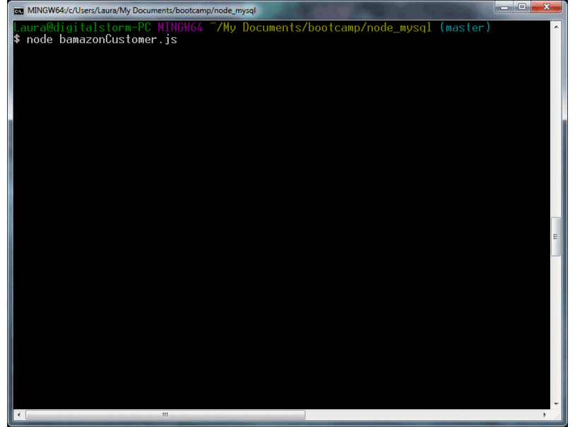
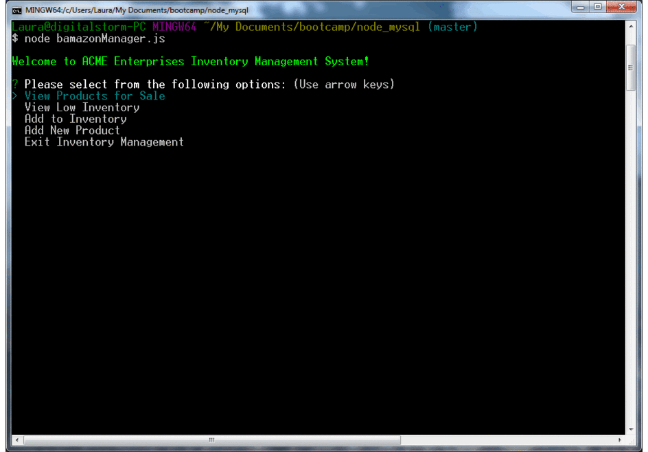

# Node_MySQL

### Overview Bamazon Customer Application

The Bamazon Customer Application will allow a customer to view the current catalog of products at ACME Enterprises and place an order.

1. When the customer starts the application, a list of available products is retrieved from the product database.

2. The customer is then prompted to select a product by product ID.

3. The customer is prompted to indicate how many of that item she/he wishes to order.

4. The order intake system then queries the product database to determine if the customer's order can be fulfilled.

5. If there is insufficient stock to fulfill the order, the ordering system will notify the customer and allow the customer to place another order.

6.  If the customer does not wish to place another order, an apology is offered, the connection ends and the application closes.

7. If the customer's order can be fulfilled (there is sufficient inventory), then the customer is notified that the order was successful and given the total cost of the order.

8. When an order is successfully placed, the inventory quantity is updated in the database and the connection ends.

### Overview Bamazon Manager Application

The Bamazon Manager Application will allow a manager at ACME Enterprises to view the current product inventory, check for low stock products, restock products and add new products to the inventory database.

1. When the manager starts the application, there is a menu of options to choose from:
	*View Products for Sale
	*View Low Inventory
	*Add to Inventory
	*Add New Product
	*Exit Inventory Management

2. If the manager selects View Products, the current catalog of available products will be retrieved from the products database and displayed, including all fields in the products table.  

3. If the manager selects View Low Inventory, the products database will be queried and return any products which have fewer than 5 units in stock.  This data will be displayed to the manager.

4. If the manager selects Add to Inventory, the application will prompt the manager for the product ID to update and the number of units to add to the inventory in the products database.  The database is then updated with the new product quantity.

5. If the manager selects Add New Product, the application leads the manager through entering the data required.  The manager will need to indicate the product name, the department which will carry that product, the product selling price and the number of units to add to the inventory. The database is then updated with the new product information.

6. After each menu action completes, the application will return to the main menu so that the manager can make another selection.

7. If the manager selects Exit Inventory Management, the application will disconnect from the database and close.

- - -

## Copyright

Laura Ward © 2017. All Rights Reserved.